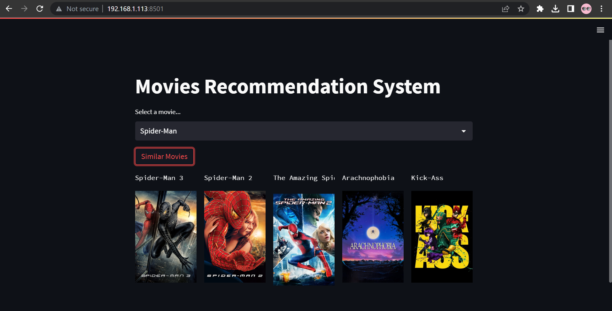
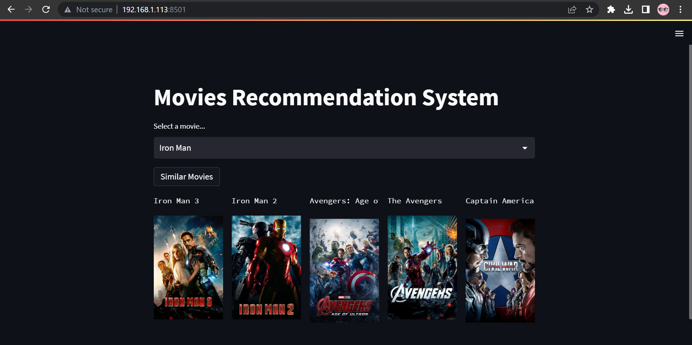
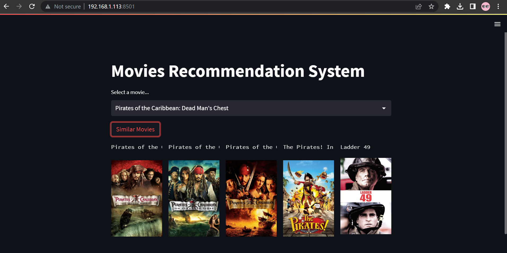

## A Content-Based Filtering - Movies Recommendation System.
### Databases : TMDB 5000 Movie Dataset (https://www.kaggle.com/datasets/tmdb/tmdb-movie-metadata) & TMDB API (https://www.themoviedb.org/)
### Technologies/Frameworks: Python, Pandas, Numpy, Sklearn, streamlit (Frontend Framework)

#### run _movie-recommender-engine.ipynb_ and get pkl files and add to your project workplace

#### install required packages & run _streamlit run main.py_

Local URL: http://localhost:8501

Network URL: http://192.168.1.113:8501

Example Outputs:

